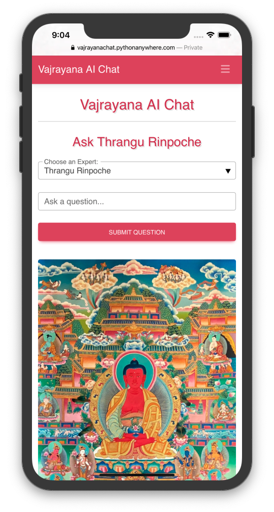
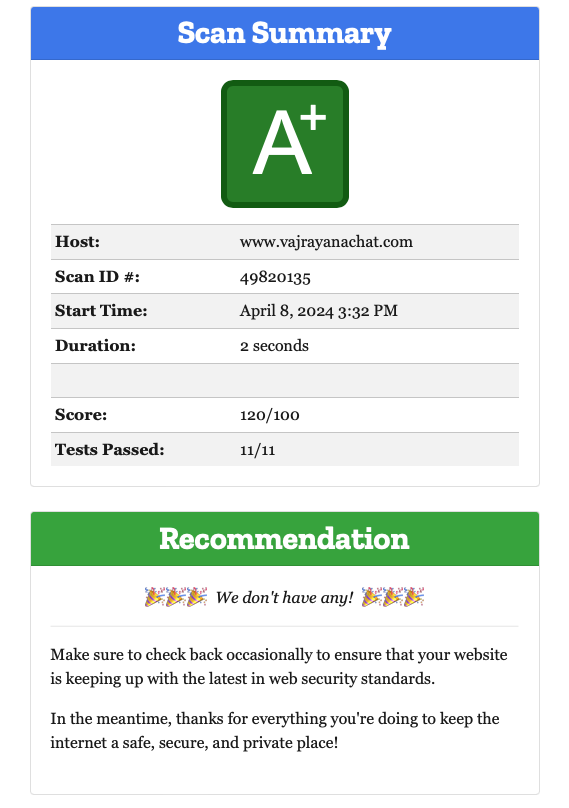

# Vajrayana AI Chat App

#### Converse with Tibetan Buddhist Tulkus and Teachers on your laptop or smartphone!

## Instructions

To use the app, visit the homepage [https://vajrayanachat.pythonanywhere.com](https://vajrayanachat.pythonanywhere.com "Vajrayana AI Chat App") in your web browser, then login using your username & password. Once you are logged-in, choose an Expert, enter your question in the input field, and click 'submit question'. It's that simple!

You can also create your own Experts, add Documents (in the form of text/PDF files, web pages, or YouTube video urls) and view previous Conversations by choosing these options from the navbar.

---

### Vajrayana AI Chat receives an A+ Security Rating on Mozilla Observatory (higher than 99% of websites):

---

### Created using:

- Backend: Python, Django, SQLite, & OpenAI Chat Completions API

- Frontend: HTMX & Material Design for Bootstrap

- Testing: Pytest (with 96% code coverage)

- CI Pipeline: Github Actions
